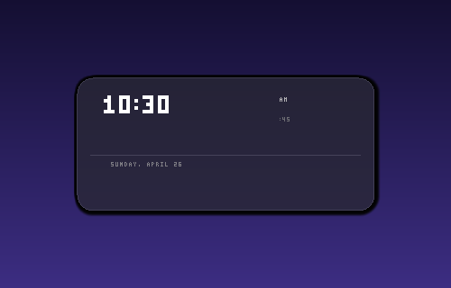

# LightClock

A lightweight desktop clock overlay for Windows, implemented with **minimal dependencies** using **Win32 API + GDI** (no WinUI 3 / Windows App SDK).



---

## Features

- Transparent text-only overlay style (no panel background)
- Date above large centered time
- Always on top by default
- Drag anywhere to move (`WM_NCHITTEST -> HTCAPTION`)
- Right-click menu:
  - Always on Top (toggle)
  - Exit
- Updates once per second

---

## Requirements

- Windows 10/11
- .NET 8 SDK (for local build with `dotnet`)

---

## Build & Run

### Command line

```powershell
dotnet restore LightClock/LightClock.csproj
dotnet build LightClock/LightClock.csproj -c Release -p:Platform=x64
dotnet run --project LightClock/LightClock.csproj -c Debug -p:Platform=x64
```

### Publish (self-contained)

```powershell
dotnet publish LightClock/LightClock.csproj `
    -c Release `
    -r win-x64 `
    --self-contained true `
    -p:Platform=x64 `
    -o publish/
```

---

## GitHub Actions (automatic Windows build)

Workflow: `.github/workflows/windows-build.yml`

- Runs on `windows-latest`
- Restores, builds, and publishes `win-x64`
- Uploads artifact: `LightClock-win-x64`

---

## Project Structure

```text
LightClock/
├── LightClock.sln
├── .github/workflows/windows-build.yml
└── LightClock/
    ├── LightClock.csproj
    ├── Program.cs
    ├── app.manifest
    └── Assets/AppIcon.ico
```
